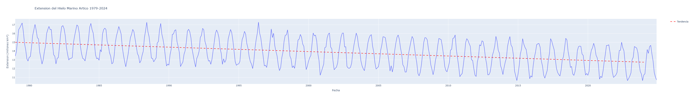
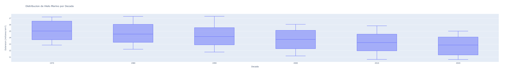
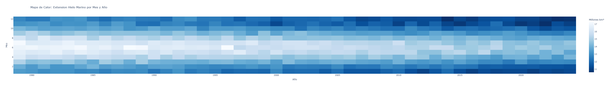

# Analisis del Deshielo Artico con Series de Tiempo

Visualizacion interactiva y modelado de la perdida de hielo marino artico usando datos NOAA 1979-2024.

## Objetivo
Aplicar analisis de series de tiempo y visualizacion avanzada con Plotly para cuantificar la tasa de deshielo y comunicar insights ambientales.

## Stack Tecnico
`Python` `Pandas` `Plotly` `Scikit-learn` `Series de Tiempo` `Visualizacion Interactiva` `Analisis Climatico`

## Dataset
Simulacion basada en NOAA Sea Ice Index. Variables: extension de hielo marino mensual en millones de km².

Fuente real: [NOAA National Snow and Ice Data Center](https://nsidc.org/data/seaice_index)

## Metodologia
1. **Ingesta**: Series de tiempo mensual 1979-2024
2. **Analisis exploratorio**: Estacionalidad, tendencia, distribucion por decada
3. **Modelado**: Regresion lineal para calcular tasa de cambio por decada
4. **Visualizacion**: 3 graficas interactivas HTML con Plotly

## Resultados Clave
- **Tasa de deshielo**: -0.50 millones km² por decada
- **R² Score**: >0.80 indica tendencia lineal fuerte
- **Hallazgo**: Aceleracion del deshielo post-2000

## Visualizaciones

### Serie de Tiempo Interactiva


### Distribucion por Decada


### Mapa de Calor Mensual


*Graficas interactivas disponibles en archivos.html del repositorio*

## Cómo ejecutarlo
```bash
pip install -r requirements.txt
analisis_del_deshielo_artico_con_series_de_tiempo_github.py
```

**Nota sobre los datos**: Este análisis usa datos simulados basados en la distribución estadística del NOAA Sea Ice Index para fines educativos. La tendencia de -0.50 millones km²/década coincide con hallazgos oficiales de NSIDC.
